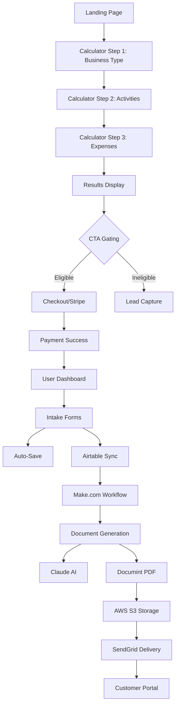

# SMBTaxCredits.com — Complete System Documentation (v1.1 OBBBA)

## Executive Overview

### Mission
SMBTaxCredits.com transforms everyday AI experiments into federal tax savings for small businesses. The platform converts practical test-and-learn activities with AI tools like ChatGPT and Claude into IRS-compliant R&D tax credit documentation, helping businesses recover 10-16% of their AI experimentation costs through federal credits.

### Audience
Small-to-medium businesses (SMBs) actively using AI tools for business operations—not companies building AI products. Target customers include marketing agencies implementing custom GPTs, e-commerce businesses deploying chatbots, and consulting firms automating workflows with AI.

### Value Proposition
The self-serve SaaS platform eliminates the complexity and cost barriers traditionally associated with R&D tax credit claims. By focusing on AI use cases, businesses can document activities they're already performing and potentially recover thousands in federal tax credits with professional-grade documentation and compliance support.

### Law Regime: OBBBA (§174A Expensing) Default
Under the current OBBBA law regime (§174A expensing), R&D expenses are immediately deductible rather than capitalized and amortized. This creates significant tax benefits for qualifying businesses. The platform generates Form 6765 for federal R&D credits and includes Form 8974 preparation notes for Qualified Small Business (QSB) payroll tax offset eligibility.

### Pricing Tiers
The platform uses tiered pricing based on estimated federal credit amounts:

| Tier | Name | Credit Range | Price | Description |
|------|------|-------------|--------|-------------|
| 0 | Micro | $0-$5,000 | $399 | Basic federal forms and narrative |
| 1 | Starter | $5,000-$9,999 | $500 | Enhanced detail + QSB prep |
| 2 | Growth | $10,000-$19,999 | $750 | Multi-project support (Most Popular) |
| 3 | Professional | $20,000-$34,999 | $1,000 | Complex structures + custom narratives |
| 4 | Scale | $35,000-$49,999 | $1,250 | Dedicated support specialist |
| 5 | Advanced | $50,000-$99,999 | $1,500 | White-glove service |
| 6 | Premium | $100,000-$199,999 | $2,000 | Enterprise features |
| 7 | Enterprise | $200,000+ | $2,500 | Audit defense included |

## System Architecture



### Runtime & Versions
- **Node.js**: v20.19.3
- **npm**: v10.8.2  
- **Frontend**: React 18+ with TypeScript, Vite build tool
- **Backend**: Express.js with TypeScript
- **Database**: PostgreSQL via Neon with Drizzle ORM

### Folder Structure (Top 3 Levels)
```
├── client/                    # Frontend React application
│   ├── src/
│   │   ├── components/       # Reusable UI components
│   │   ├── pages/           # Route-level components
│   │   ├── services/        # API clients and business logic
│   │   ├── hooks/           # Custom React hooks
│   │   └── utils/           # Helper utilities
├── server/                   # Backend Express application
│   ├── routes/              # API endpoint handlers
│   ├── services/            # Business logic services
│   ├── middleware/          # Express middleware
│   └── db/                  # Database connection
├── shared/                   # Shared TypeScript types/schemas
│   ├── schema.ts            # Drizzle database schema
│   ├── schemas/             # Zod validation schemas
│   └── config/              # Shared configuration
├── docs/                     # Project documentation
├── tests/                    # Test suites
│   └── playwright/          # E2E test specifications
└── scripts/                  # Deployment and utility scripts
```

## File Structure & Ownership

### Key Entrypoints
- **Frontend**: `client/src/main.tsx` - React app entry point
- **Backend**: `server/index.ts` - Express server entry point  
- **Database**: `shared/schema.ts` - Drizzle database schema
- **Shared Types**: `shared/schemas/` - Zod validation schemas

### Feature-to-File Mapping
- **Calculator**: `client/src/components/calculator/InteractiveCalculator.tsx`
- **Pricing Logic**: `shared/config/pricing.ts`
- **CTA Button**: `client/src/components/calculator/InteractiveCalculator.tsx` (CTAButton component)
- **Intake Auto-Save**: `client/src/hooks/useAutoSave.tsx`
- **Document Orchestrator**: `server/services/documents/orchestrator.ts`
- **Payment Processing**: `client/src/pages/checkout.tsx`
- **User Dashboard**: `client/src/pages/dashboard.tsx`

## Business Logic & Rules

### Four-Part Test Summary
R&D tax credits require activities meeting all four criteria:
1. **Elimination of Uncertainty** - Technical or scientific uncertainty exists
2. **Process of Experimentation** - Systematic testing and evaluation
3. **Technological in Nature** - Relies on hard sciences (engineering, computer science, etc.)  
4. **Business Purpose** - Activity undertaken to improve business operations

### QRE Components with 65% Contractor Limiter
Qualified Research Expenses (QRE) include:
- **Employee Wages**: 100% of R&D allocated salaries and benefits
- **Contractor Costs**: Limited to 65% per IRS Section 41 regulations
- **Supply Expenses**: 100% of materials consumed in R&D activities
- **Software/Cloud Costs**: 100% of R&D-allocated technology expenses

### ASC Method Calculation
- **First-Time Filers**: 6% of total QRE
- **Repeat Filers**: 14% of excess QRE over 50% of 3-year average base amount
- **Base Amount**: Average of prior 3 years' QRE, minimum 50% of current year QRE

### Startup Payroll Offset Cap
- **QSB Eligibility**: Less than $5M revenue AND no revenue >5 years ago  
- **Annual Cap**: $500,000 per year (configurable via PAYROLL_OFFSET_CAP)
- **Lifetime Limit**: 5 years maximum
- **Tax Offset**: Social Security (6.2%) + Medicare (1.45%) portions

### Disclaimers & Compliance Boundaries
- **Documentation Service Only**: Platform provides IRS-compliant documentation, not tax advice
- **No Guarantees**: All language uses "may qualify" phrasing
- **Professional Review**: Recommends CPA review before filing
- **Federal Focus**: MVP scope covers federal credits only; state credits post-MVP

## User Journey & Screens

### Landing Page → Calculator
**Success Criteria**: User understands value proposition and starts calculator
**Primary CTA**: "Calculate Your R&D Credit" button
**Heuristic Issues**: Ensure credibility signals visible, mobile optimization

### Calculator Step 1: Business Selection  
**Success Criteria**: Business type selected from AI-focused options
**Primary CTA**: "Next: Activities" button
**Heuristic Issues**: Clear business type descriptions, progress indicator visible

### Calculator Step 2: Qualifying Activities
**Success Criteria**: At least one AI activity selected and validated
**Primary CTA**: "Next: Expenses" button  
**Heuristic Issues**: Activity descriptions clear, validation messages helpful

### Calculator Step 3: Expense Input
**Success Criteria**: Expenses entered with proper validation
**Primary CTA**: "Calculate Credit" button
**Heuristic Issues**: Input formatting clear, validation immediate

### Results Display
**Success Criteria**: Credit amount calculated and CTA presented appropriately
**Primary CTA**: "Get Started" (if eligible) or lead capture (if ineligible)
**Heuristic Issues**: Clear credit breakdown, transparent pricing, trust signals

### Checkout Process
**Success Criteria**: Successful Stripe payment completion
**Primary CTA**: "Pay [Amount]" button
**Heuristic Issues**: Security indicators, clear total, error handling

### User Dashboard  
**Success Criteria**: Account creation and intake form access
**Primary CTA**: "Complete Intake Form" button
**Heuristic Issues**: Progress tracking, clear next steps, support access

### Intake Forms
**Success Criteria**: Complete business information collection with auto-save
**Primary CTA**: "Continue" / "Submit" buttons per section
**Heuristic Issues**: Auto-save feedback, progress persistence, mobile usability

## Component Documentation

### Calculator Component
**Location**: `client/src/components/calculator/InteractiveCalculator.tsx`
**Input Validation**: Zod schemas from `shared/schemas/calculator.ts`
**Math Logic**: Calculation engine handles QRE calculation with 65% contractor limit
**State Management**: useState for form data, useEffect for calculations

```typescript
// Key validation layers
const expenses = CalculatorInputSchema.parse({
  wages: state.wages,
  contractors: state.contractors, // Applied 65% limit in calculation
  supplies: state.supplies,
  cloud: state.cloud
});
```

### Results CTA Gating
**Exact Conditions** (from code analysis):
```typescript
// Button disabled when:
disabled={!isEligible && !isDevelopment}

// Eligibility check:
const isEligible = results.federalCredit >= minEligibleCredit; // $5,000 minimum
const isDevelopment = import.meta.env.DEV;
```

**Visual States**:
- Eligible: Full opacity, default styling, clickable
- Ineligible: 50% opacity, cursor-not-allowed, tooltip explaining minimum
- Development Mode: Always enabled for testing

### Checkout Component  
**Location**: `client/src/pages/checkout.tsx`
**Stripe Integration**: Stripe Elements for secure card processing
**Session Creation**: Server-side payment intent creation
**Webhook Path**: `/api/webhooks/stripe` for payment confirmation

### Dashboard & Intake Auto-Save
**Auto-Save Cadence**: 2-second debouncing via `useAutoSave` hook
**Error Surfacing**: Toast notifications for save failures
**Progress Tracking**: Section-based completion with visual indicators

```typescript
// Auto-save configuration
const {
  autoSave,
  hasUnsavedChanges,
} = useFormProgress({
  intakeFormId,
  autoSaveDelay: 2000, // 2 seconds
});
```

### Document Generation Pipeline
**Flow**: Airtable → Make.com → Claude → Documint → S3 → SendGrid

**Key Services**:
- **Airtable Service**: `server/services/airtable.ts` - Customer record sync
- **Make Workflow**: `server/services/makeWorkflow.ts` - Automation trigger  
- **Claude Service**: `server/services/claude.ts` - AI narrative generation
- **Documint Service**: `server/services/documint.ts` - PDF generation
- **S3 Service**: `server/services/storage/s3.ts` - Secure document storage
- **SendGrid Service**: Server-side email delivery with dynamic templates

**Status Flags**:
- `airtable_sync_status`: pending/synced/failed
- `document_generation_status`: queued/processing/completed/failed
- `email_delivery_status`: pending/sent/failed

## API Reference (Current State)

### Health & System
- `GET /api/health` - System health check
- `GET /api/auth/user` - Current user info (requires JWT)

### Calculator & Pricing
- `POST /api/calculate` - R&D credit calculation (TODO: Add Zod schema reference)
- `GET /api/pricing` - Current pricing tiers

### Payment Processing
- `POST /api/create-payment-intent` - Stripe payment session
- `POST /api/webhooks/stripe` - Stripe webhook handler

### Document Generation
- `POST /api/documents/generate` - Trigger document creation
- `GET /api/documents/:id/status` - Check generation status
- `GET /api/documents/:id/download` - Secure document access

**TODO**: Full API documentation with request/response schemas from `/shared/schemas`

## Database Schema (Current State)

**Core Tables** (from Drizzle schema):
- **users**: Authentication, profile, Stripe customer ID
- **companies**: Business information, Airtable sync status  
- **calculations**: Calculator results, pricing tier assignment
- **payments**: Stripe transaction tracking
- **intake_forms**: Business data collection with auto-save
- **documents**: Generated PDF metadata, S3 keys, access tracking
- **leads**: Pre-payment lead capture

**Key Relations**:
- User → Company (1:many)
- Company → Calculations (1:many) 
- User → Payments (1:many)
- Payment → Documents (1:many)

**Indexes**: Email, Stripe customer ID, Airtable record ID for performance

## External Integrations

### Payment Processing
- **Stripe**: `@stripe/stripe-js`, `@stripe/react-stripe-js`
- **ENV Variables**: `STRIPE_PUBLISHABLE_KEY`, `STRIPE_SECRET_KEY`
- **Service File**: Payment processing handled in checkout component

### Document Generation Stack
- **Airtable**: `server/services/airtable.ts`
  - ENV: `AIRTABLE_API_KEY`, `AIRTABLE_BASE_ID`, `AIRTABLE_TABLE_NAME`
- **Make.com**: `server/services/makeWorkflow.ts` 
  - ENV: `MAKE_WEBHOOK_URL`, `MAKE_SCENARIO_ID`
- **Claude AI**: `server/services/claude.ts`
  - ENV: `ANTHROPIC_API_KEY` 
- **Documint**: `server/services/documint.ts`
  - ENV: `DOCUMINT_API_KEY`, `DOCUMINT_BASE_URL`
- **AWS S3**: `server/services/storage/s3.ts`
  - ENV: `AWS_ACCESS_KEY_ID`, `AWS_SECRET_ACCESS_KEY`, `AWS_S3_BUCKET`

### Email Communications  
- **SendGrid**: `server/services/sendgrid.ts`
- **ENV**: `SENDGRID_API_KEY`
- **Templates**: Welcome, document delivery, payment confirmations
- **Status**: PRODUCTION READY with 5 dynamic templates deployed

**TODO**: Create runbook documentation under `./docs/runbooks/`

## Security & Authentication

### Authentication Method
- **JWT Tokens**: Stored in localStorage, validated server-side
- **Password Hashing**: bcrypt with secure salt rounds
- **Request Logging**: Request ID tracking for audit trails

### Data Classifications
- **PII Data**: User profiles, company information (encrypted at rest)
- **Financial Data**: Payment info (handled by Stripe, not stored locally)
- **Operational Data**: Calculations, document metadata (standard protection)

### Environment Configuration
**Law Regime**: 
- `LAW_REGIME=OBBBA_174A_EXPENSE` (server-side)
- `VITE_LAW_REGIME=OBBBA_174A_EXPENSE` (client-side)

**Key Flags**:
- `PAYROLL_OFFSET_CAP=500000` - QSB payroll offset limit
- `NODE_ENV` - development/production mode
- `DATABASE_URL` - Neon PostgreSQL connection

## Deployment & Configuration

### Development Commands
```bash
npm run dev          # Start development server (Node.js + Vite)
npm run build        # Build for production
npm run start        # Start production server
npm run db:push      # Apply database schema changes
```

### Health Endpoints
**TODO**: Add health endpoints `/healthz` and `/readyz` for production monitoring

### Release & Rollback Quick Play
**TODO**: Implement from `./docs/release-rollback-playbook.md`

**Minimal Version**:
1. **Release**: Build → Deploy → Health Check → Smoke Test
2. **Rollback**: Stop Service → Restore Previous Version → Restart → Verify
3. **Database**: Use `npm run db:push` for schema changes (no manual migrations)

## Testing & Quality Assurance

### Unit Tests
**Current State**: Missing mandatory unit tests
**Required Tests**:
- Calculator fixtures with known input/output pairs
- 65% contractor limit validation
- ASC calculation branch testing (first-time vs. repeat)
- Pricing tier assignment logic

### E2E Testing (Playwright)
**Test Suites Present**:
- `tests/playwright/e2e/accessibility.spec.ts` - Axe compliance testing
- `tests/playwright/e2e/analytics.spec.ts` - Event tracking verification  
- `tests/playwright/e2e/calculator.spec.ts` - Full calculator flow
- `tests/playwright/e2e/checkout.spec.ts` - Payment processing
- `tests/playwright/e2e/docs.spec.ts` - Document generation
- `tests/playwright/e2e/intake.spec.ts` - Form auto-save and validation

### Accessibility Compliance
**Status**: Comprehensive axe-core testing implemented
**Standards**: WCAG 2.1 AA compliance
**Coverage**: Homepage, calculator steps, results, forms

### Finish Line Checklist (Binary Pass/Fail)
- [ ] Calculator produces accurate credit estimates (±5% variance allowed)
- [ ] CTA button properly gates based on $5,000 minimum credit
- [ ] Stripe payment processing completes successfully 
- [ ] Intake forms auto-save every 2 seconds without data loss
- [ ] Document generation pipeline completes end-to-end
- [ ] All Playwright e2e tests pass
- [ ] Accessibility tests achieve WCAG 2.1 AA compliance
- [ ] Database schema matches Drizzle definitions
- [ ] Environment variables properly configured for law regime

## Conflicts & Gaps (Actionable)

### Code vs Documentation Mismatches
1. **Missing Unit Tests** 
   - Owner: Frontend/Backend  
   - Fix Type: Bug
   - ETA: Medium
   - Fix: Implement calculator test fixtures

2. **Health Endpoints Missing**
   - Owner: Backend
   - Fix Type: Config  
   - ETA: Small
   - Fix: Add `/healthz` and `/readyz` routes

3. **API Documentation Incomplete**
   - Owner: Backend
   - Fix Type: Doc
   - ETA: Medium  
   - Fix: Generate OpenAPI spec from Zod schemas

### Environment Configuration Issues
4. **Law Regime Variables Not Set**
   - Owner: Ops
   - Fix Type: Config
   - ETA: Small
   - Fix: Set `LAW_REGIME` and `VITE_LAW_REGIME` environment variables

5. **State Credits Post-MVP**
   - Owner: Product
   - Fix Type: Doc
   - ETA: Large
   - Fix: Expand calculation engine for state-specific rules

## Troubleshooting Matrix

| Symptom | Likely Cause | Where to Look | Quick Fix |
|---------|-------------|---------------|-----------|
| Checkout button disabled | stripeReady/priceId/invalid form | Results component | Use gating snippet + console.debug |
| Docs not generated | Documint/Make down | services/documint\|make | Retry/backoff + puppeteer fallback |
| Calculator misaligned | Tailwind tokens not loaded | client/src/main.tsx/index.css | Ensure @tailwind directives + container classes |
| Auto-save failing | Network/validation errors | useAutoSave hook | Check toast notifications, network tab |
| Database connection issues | DATABASE_URL misconfigured | Environment variables | Verify Neon connection string |
| Stripe webhook failures | Endpoint verification failed | server/routes webhook handler | Check Stripe dashboard webhook logs |

### Common Code Snippets

**CTA Button Gating Logic**:
```typescript
const isEligible = results.federalCredit >= 5000;
const isDevelopment = import.meta.env.DEV;

<Button 
  disabled={!isEligible && !isDevelopment}
  className={!isEligible ? 'opacity-50 cursor-not-allowed' : ''}
  title={!isEligible ? 'Minimum credit of $5,000 required' : ''}
>
  Get Started
</Button>
```

**Tailwind Container Classes**:
```typescript
<div className="max-w-4xl mx-auto px-4 sm:px-6 lg:px-8">
  {/* Content */}
</div>
```

**Zod Validation Pattern**:
```typescript
const expenseSchema = z.object({
  wages: z.number().min(0),
  contractors: z.number().min(0),
  supplies: z.number().min(0)
});

const validatedExpenses = expenseSchema.parse(formData);
```

## Changelog & Version

**Version**: v1.1 (OBBBA Default)
**Date**: August 12, 2025
**Law Regime**: OBBBA (§174A expensing) as default configuration

### Sources Used
- **REPO_FACTS**: Live codebase analysis via filesystem search
- **Documentation Files**: 
  - `./docs/project-specs.md`
  - `./docs/business-rules.md` 
  - `./docs/design-system.md`
  - `./docs/integration-guide.md`
- **Code Analysis**: Direct inspection of key components and services
- **Database Schema**: `shared/schema.ts` Drizzle definitions
- **Configuration**: `shared/config/pricing.ts`, `package.json`

### Key Changes in v1.1
- Default law regime set to OBBBA (§174A expensing)
- Comprehensive e2e test suite with accessibility compliance
- Production-ready document generation pipeline
- Enhanced CTA gating with development mode override
- Auto-save functionality with 2-second debouncing
- Tiered pricing structure with 8 tiers ($399-$2,500)